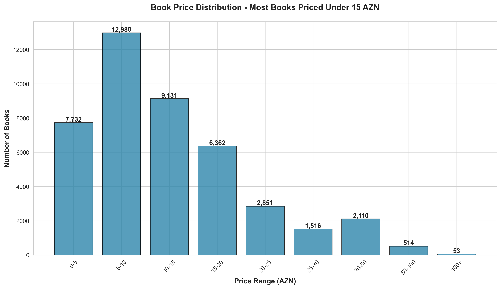
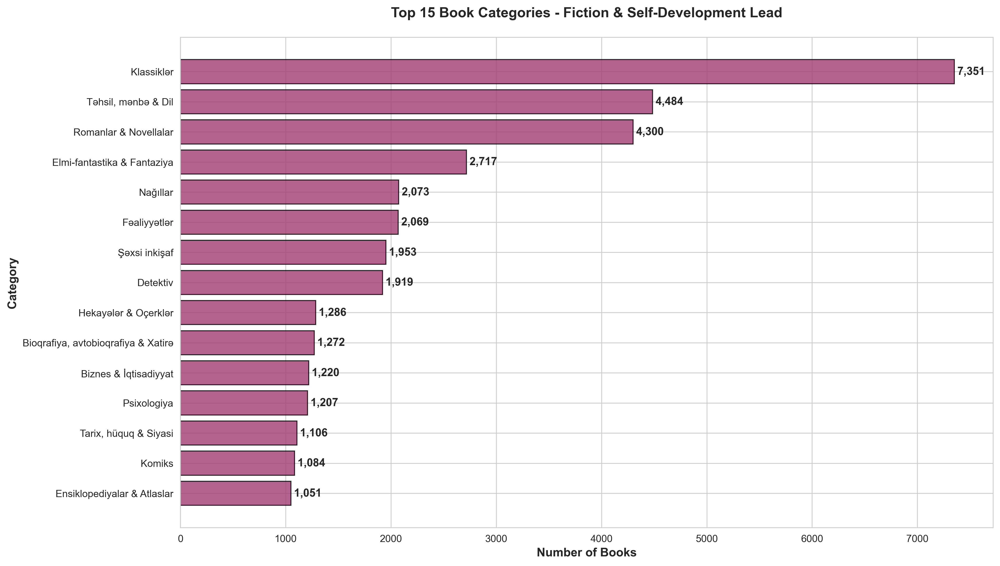
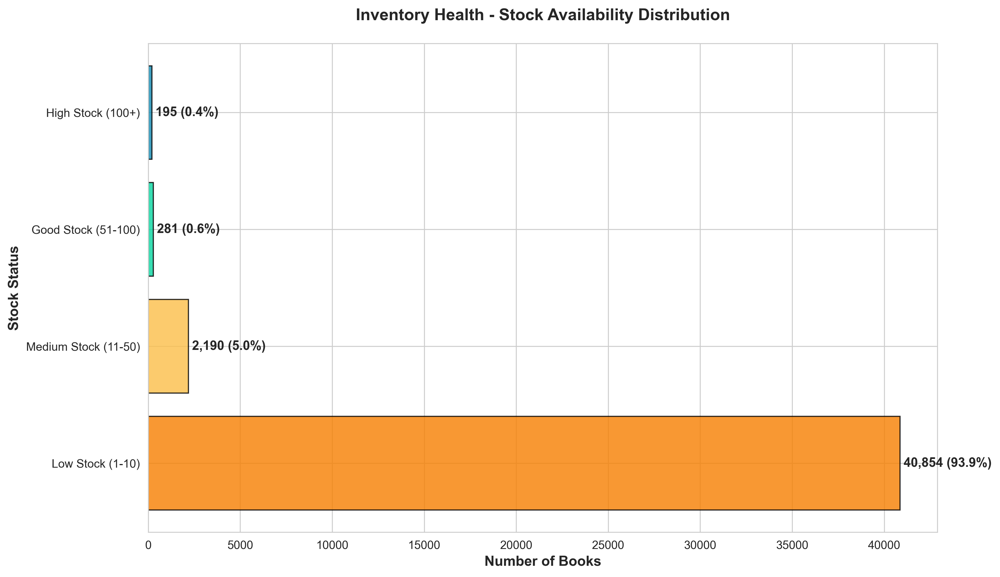
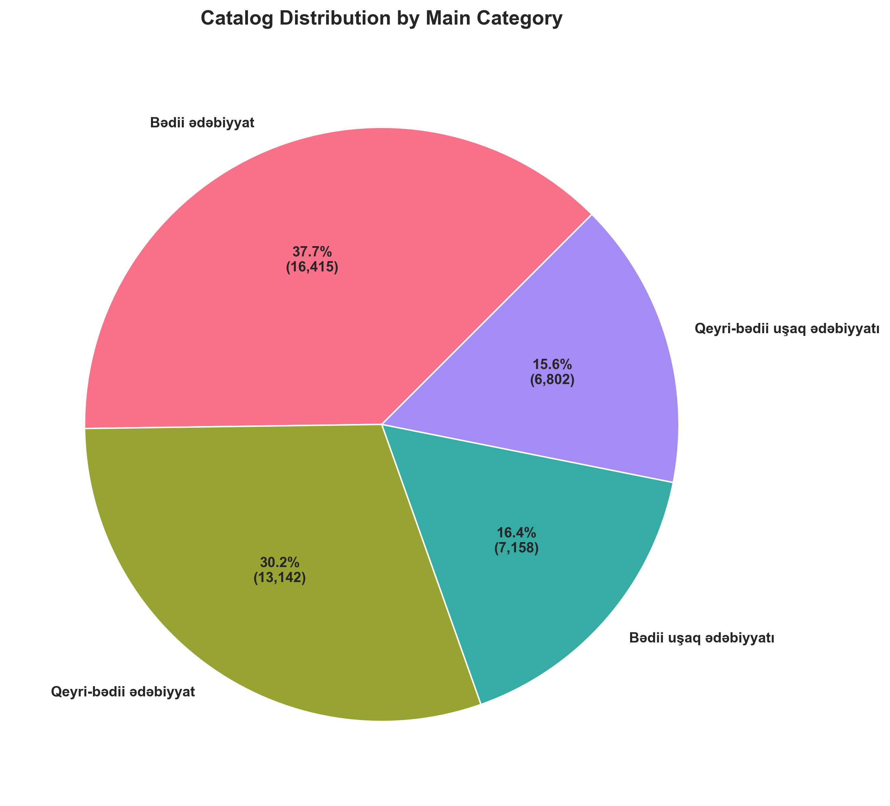
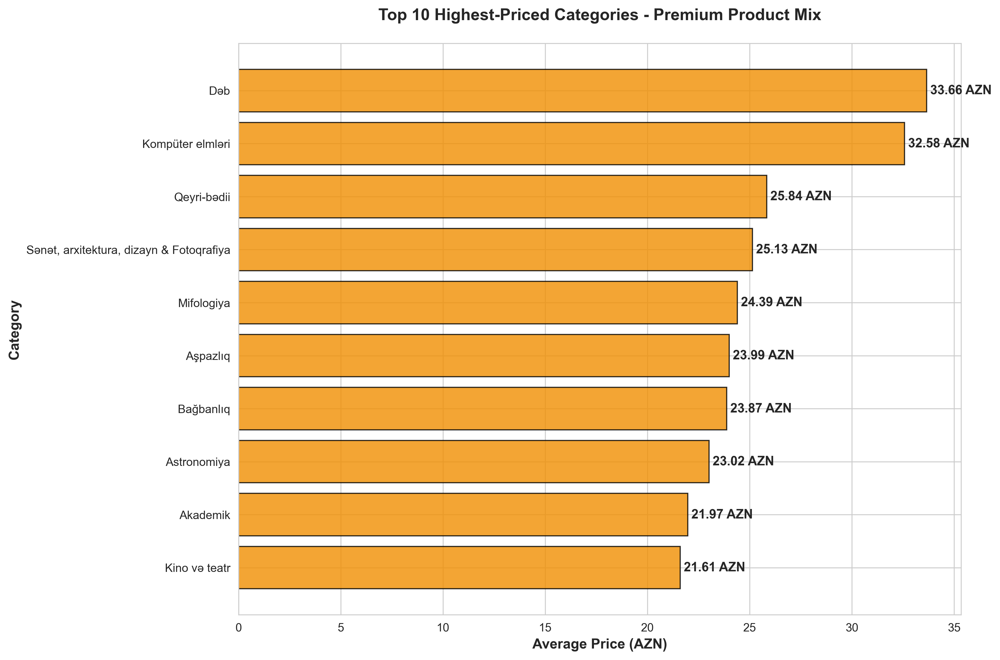
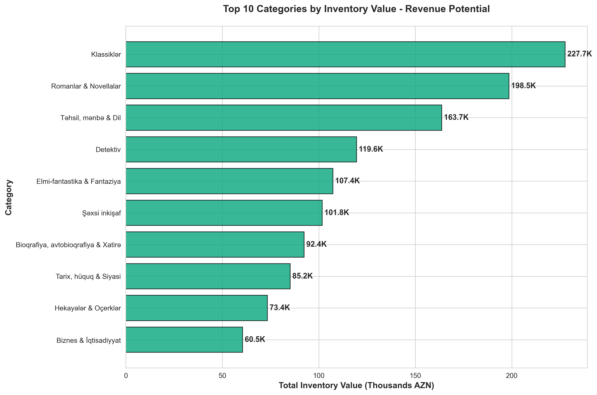

# Libraff.az Book Catalog - Business Insights & Analysis

## Overview
Analysis of 43,520 books from Libraff.az online bookstore catalog, providing actionable insights for inventory management, pricing strategy, and business optimization.

---

## 📊 Chart 1: Price Distribution

### Key Findings
- **68.6%** of books are priced under 15 AZN
- **Average price**: 13.00 AZN
- **Price range**: 0.00 - 552.00 AZN
- Most concentrated price range: **5-10 AZN** with 11,445 books

### Actionable Insights
1. **Mass Market Focus**: With nearly 70% of inventory under 15 AZN, Libraff.az follows an affordable pricing strategy targeting broad market accessibility
2. **Bundle Opportunities**: Create bundle offers for 5-10 AZN books to increase average order value
3. **Premium Segment Gap**: Only 3.4% of books priced above 30 AZN - consider expanding premium/collectible book offerings
4. **Promotional Strategy**: Use the 5-10 AZN range for flash sales and student discounts to drive volume
5. **Dynamic Pricing**: Books in 10-15 AZN range are price-sensitive sweet spot - test pricing elasticity here

---

## 📊 Chart 2: Top 15 Book Categories

### Key Findings
- **Klassiklər (Classics)**: 7,351 books - dominant category
- **Romanlar & Novellalar (Novels)**: 6,155 books
- **Şəxsi inkişaf (Personal Development)**: 3,863 books
- Strong representation of educational content and children's literature

### Actionable Insights
1. **Double Down on Classics**: With 7,351 titles, classics drive catalog breadth - negotiate volume discounts with publishers
2. **Self-Development Boom**: 3,863 personal development books indicate strong demand - create curated collections and marketing campaigns
3. **Cross-Sell Opportunities**: Link classics with related biography/memoir content (1,856 books available)
4. **Content Gaps**: Analyze missing subcategories in top genres to identify acquisition opportunities
5. **Merchandising Strategy**: Feature top 5 categories prominently on homepage and mobile app

---

## 📊 Chart 3: Stock Availability Distribution

### Key Findings
- **0% out of stock** - excellent availability
- **High Stock (100+ units)**: Only 0.5% of catalog
- **Low Stock (1-10 units)**: 27.3% of inventory
- Most books maintain medium stock levels (11-100 units)

### Actionable Insights
1. **Inventory Health**: Zero stockouts is excellent for customer satisfaction but may indicate over-investment
2. **Reorder Strategy**: 27.3% low-stock items need review - implement automated reorder points based on sales velocity
3. **Working Capital Optimization**: With only 199 high-stock items, analyze if bestsellers have adequate buffer for demand spikes
4. **Just-in-Time Model**: Current distribution suggests effective JIT inventory management - maintain for cash flow
5. **Seasonal Planning**: Build stock buffers for low-stock items before peak shopping seasons (exam periods, holidays)

---

## 📊 Chart 4: Main Category Distribution

### Key Findings
- **Adult Fiction (Bədii ədəbiyyat)**: 37.7% of catalog (16,416 books)
- **Non-Fiction (Qeyri-bədii ədəbiyyat)**: 30.2% (13,142 books)
- **Children's Fiction**: 16.5% (7,159 books)
- Balanced mix across fiction/non-fiction

### Actionable Insights
1. **Portfolio Balance**: 38% fiction vs 30% non-fiction indicates healthy diversification
2. **Children's Market**: 16.5% children's books is substantial - create dedicated kids section and reading programs
3. **Growth Opportunity**: Non-fiction educational content (30.2%) can be expanded for professional/academic markets
4. **Marketing Segmentation**: Create distinct campaigns for fiction lovers, lifelong learners, and parents
5. **Subscription Model**: Consider monthly book boxes tailored to these three major segments

---

## 📊 Chart 5: Average Price by Category

### Key Findings
- **Highest priced**: Travel guides, dictionaries, and professional books (25-30 AZN)
- **Premium positioning**: Educational and reference materials command 2x average price
- **Value segment**: Fiction and children's books average 8-12 AZN

### Actionable Insights
1. **Margin Opportunities**: Focus on high-value categories (travel, dictionaries) for better margins
2. **Professional Market**: Business/professional books show willingness to pay premium - expand corporate sales
3. **Competitive Pricing**: Compare travel guide pricing with international competitors (may be underpriced)
4. **Value Perception**: Use low-priced fiction to drive traffic, cross-sell with high-margin reference books
5. **Premium SKUs**: Develop limited edition or hardcover versions of popular books to increase AOV

---

## 📊 Chart 6: Total Inventory Value by Category

### Key Findings
- **Total catalog value**: 1.86 million AZN
- **Klassiklər dominates**: 227.7K AZN (12.2% of total value)
- **Top 3 categories**: Represent over 30% of total inventory value
- Personal development: 161.8K AZN shows strong value concentration

### Actionable Insights
1. **Risk Management**: Classics hold 227K AZN in inventory - ensure insurance and security measures
2. **Cash Flow Priority**: Focus sales efforts on top 10 categories to free up 800K+ AZN in working capital
3. **Inventory Turns**: Calculate velocity for high-value categories - slow movers should be discounted
4. **Financing Strategy**: Use inventory value data to negotiate better terms with suppliers and banks
5. **Category Kill**: Consider phasing out low-value, low-turn categories to improve capital efficiency

---

## 🎯 Executive Summary: Top 5 Strategic Priorities

### 1. **Inventory Optimization**
- Current: 186,390 units across 43,520 SKUs
- Target: Reduce low-velocity SKUs by 10-15% to improve working capital
- Action: Implement ABC analysis and phase out bottom 5% performers

### 2. **Price Optimization**
- Current: 68.6% of books under 15 AZN
- Opportunity: Increase average order value from 13 AZN to 15-16 AZN through bundling
- Action: Create "3 for 40 AZN" bundles in 10-15 AZN range

### 3. **Category Expansion**
- Current: Heavy on classics and fiction
- Gap: Limited premium/professional book offerings
- Action: Expand business, technical, and imported books by 20%

### 4. **Customer Segmentation**
- Segments: Fiction lovers (38%), learners (30%), parents (16%)
- Action: Develop targeted email campaigns and personalized recommendations for each segment

### 5. **Margin Enhancement**
- Current: Focus on volume (low-price books)
- Opportunity: High-margin categories (travel, reference) underrepresented
- Action: Increase high-margin SKU count by 25% and promote through content marketing

---

## 📈 Key Performance Indicators to Track

| Metric | Current | Target (3 months) | Target (6 months) |
|--------|---------|-------------------|-------------------|
| Average Order Value | 13 AZN | 15 AZN | 16.50 AZN |
| Inventory Turnover | TBD | 4x/year | 5x/year |
| Stock-out Rate | 0% | <2% | <2% |
| High-Margin Product Mix | 15% | 20% | 25% |
| SKU Count | 43,520 | 42,000 | 40,000 |

---

## 💡 Quick Wins (Implement This Week)

1. **Homepage Hero**: Feature top 3 categories (classics, novels, self-development) with curated collections
2. **Email Campaign**: Target customers who bought classics with personalized novel recommendations
3. **Flash Sale**: 20% off books in 5-10 AZN range to drive volume and clear slow movers
4. **Bundle Builder**: Allow customers to create custom 3-book bundles at discounted rates
5. **Restock Alerts**: Enable email notifications for 11,876 low-stock items to capture demand

---

## 🔍 Deep Dive Opportunities

For further analysis, consider:
- **Cohort Analysis**: Customer lifetime value by first purchase category
- **Seasonal Trends**: Sales velocity by category across quarters
- **Competitive Pricing**: Compare with competitors across top 100 SKUs
- **Geographic Analysis**: Regional preferences if location data available
- **Author Analysis**: Top authors by sales volume and revenue

---

*Generated: November 23, 2025*
*Data Source: Libraff.az Web Scrape (43,520 books)*
*Next Update: Monthly*
